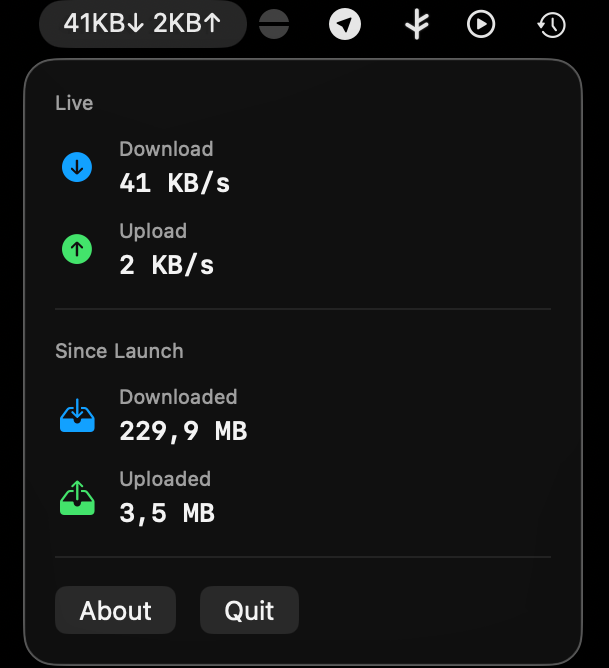

# NetRatio

NetRatio is a lightweight macOS menu bar app that shows current network download and upload bandwidth in real time.

It runs as a menu bar utility instead of a regular Dock app. The menu bar label updates continuously with live transfer rates, and clicking it opens a compact popover with current network stats and an About screen.

## Features

- Real-time download and upload monitoring
- Live bandwidth values in the macOS menu bar
- Compact popover UI for current traffic stats
- About screen with author, version, GitHub link, and copyright/license info
- Menu bar utility behavior without a standard Dock presence

## How It Works

NetRatio reads byte counters from active macOS network interfaces and calculates the delta over time to estimate the current transfer rate.

It does not generate network traffic on its own. It simply measures existing system traffic and formats it into readable download and upload speeds.

## Requirements

- macOS 15.6+
- Xcode
- Apple Silicon or Intel Mac

## Run in Xcode

1. Open the project in Xcode.
2. Select the `NetRatio` scheme.
3. Choose `My Mac` as the run destination.
4. Build and run the app.

After launch, NetRatio appears in the macOS menu bar.

## Build for Local Installation

1. In Xcode, choose `Product > Archive`.
2. In Organizer, select the archive.
3. Choose `Distribute App`.
4. Select `Copy App`.
5. Export `NetRatio.app` and move it to `/Applications`.

## Notes

- The app measures active non-loopback network interfaces.
- The update interval is currently one second.
- Very low traffic values may appear rounded in the compact menu bar label.

## Tech Stack

- Swift
- SwiftUI
- Observation
- macOS networking counters via `getifaddrs`
